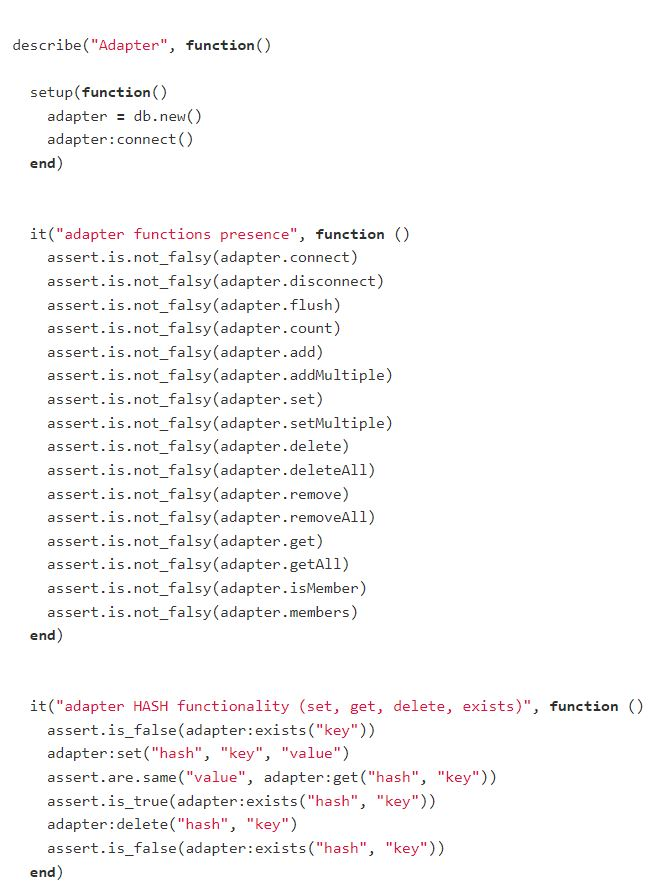

= Lua testy

V projekte pre Unit testing je použitý framework Busted.

Pre nastavenie testov sa používajú bloky `describe` a `it`. `before_each` definuje funkciu, ktorá sa má vykonať pred každým testovacím prípadom a `after_each` definuje funkciu, ktorá sa má vykonať po každom testovacom prípade.

=== Ukážka testu:

Nastavenie testovacieho modulu:

image:img/lua.JPG[lua]

Preddefinovanie objektov:

image:img/lua1.JPG[lua1]

Test Lua:

