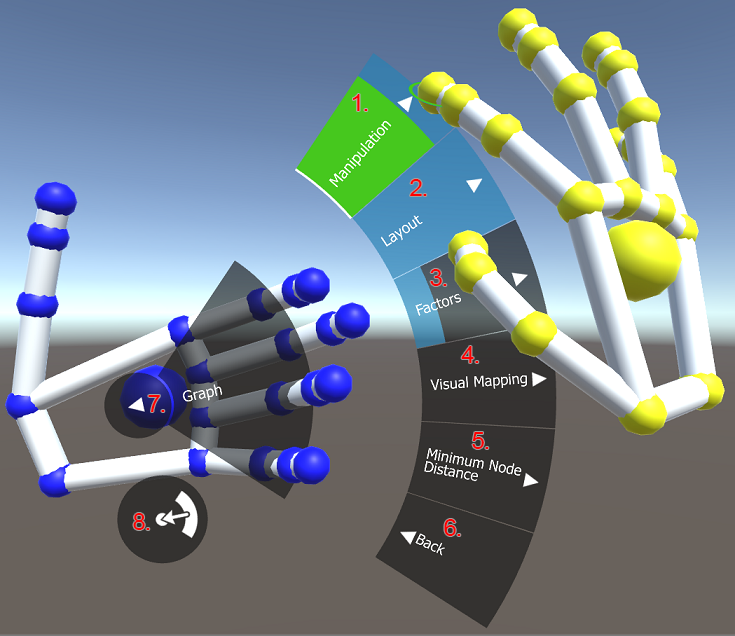

= AR + VR

V AR a VR prostredí je možné sa pohybovať prirodzeným spôsobom, tak ako v reálnom prostredí. Headset sa stará o mapovanie pozície v reálnom prostredí do virtuálneho prostredia. Interakcia s prostredím je riešená sledovaním rúk používateľa a ich mapovaním do virtuálneho prostredia. Ovládacie menu je možné otvoriť natočením ľavej dlane smerom k tvári.

== Interakcia

V scéne je zapnutá fyzická interakcia. To znamená, že rukou môžeme udierať, uchopiť a hádzať uzlami. Uchopenie je nutné vykonávať troma prstami - palec, ukazovák a prostredník.

=== HoverUI

HoverUI menu sa zobrazí len pri natočení ľavej dlane smerom na kameru. Stlačenie jednotlivých tlačidiel sa realizuje prostredníctvom priblíženia pravého ukazováka na tlačidlo. Ak tlačidlo zasvieti na svetlo-modro, znamená to, že kurzor na pravom ukazováku sa dostal k jeho blízkosti. Zelená farba znamená, že sa spustila udalosť “kliknutia”. Pomocou tlačidiel je možné manipulovať s celým grafom, kontrolovať layoutovanie, zmeniť jednotlivé faktory grafu alebo zmeniť vizuálne mapovanie.

Vysvetlenie legendy:

. Manipulation - obsahuje tlačidlá, ktoré sa týkajú manipulácie s grafom
 (napr. umiestnenie grafu na určité miesto alebo škálovanie grafu).
. Layout - obsahuje tlačidlá týkajúce sa layoutovania grafu
 (napr. štart/stop layoutu, pauza layoutu, zmena layouterov, zmena builderov
 layoutu, zmena layout funkcií a zmena premenných a funkcií).
. Factors - nastavenie faktorov (attractive a repulsive faktory).
. Visual Mapping - zmena vizuálneho mapovania pre jednotlivé Lua objekty - funkcie, priečinky, rozhrania, globálne funkcie a moduly. Pre každý typ objektu je na výber zo šiestich tvarov.
. Minimum Node Distance - nastavenie minimálnej vzdialenosti medzi uzlami.
. Back - tlačidlo pre návrat do rodičovského menu.
. ◄ - tlačidlo pre návrat do rodičovského menu. Toto tlačidlo sa taktiež dá stlačiť zovretím ľavej dlane do päste.
. ·🠈) - tlačídlo pre skrytie/zobrazenie menu.

== Selekcia

Selekciu uzlov a hrán je možné vykonať gestom pištole. Teda natiahnutím ukazováku a prostredníku a stiahnutím prstenníka a malíčka. Palec pri tomto geste slúži na selekciu a deselekciu objektu, na ktorý týmto gestom ukazujeme. Zdvihnutím palca sa objekt označí, zložením sa odznačí.

== Obmedzovače

Pre zlepšenie čitateľnosti je možné použiť obmedzovače, ktoré vedia držať a hýbať uzly vo svojom priestore a na ktorých povrch sa uzly viažu. Je možné ich vytvoriť pomocou položky “Spawn restriction” v HoverUI menu. Je možné pridať guľu, kocku, alebo plochu, ktorá sa pred nami vytvorí. Tento obmedzovač je potom možné presúvať a meniť jeho veľkosť.
Pre pridanie uzlov do tohto objektu stačí jednoducho uzol chytiť a presunúť ho dovnútra. Pre pridanie viacerých uzlov naraz je potrebné si ich označiť. Pre označenie všetkých uzlov je možné tiež použiť funkciu poskytnutú v HoverUI menu.