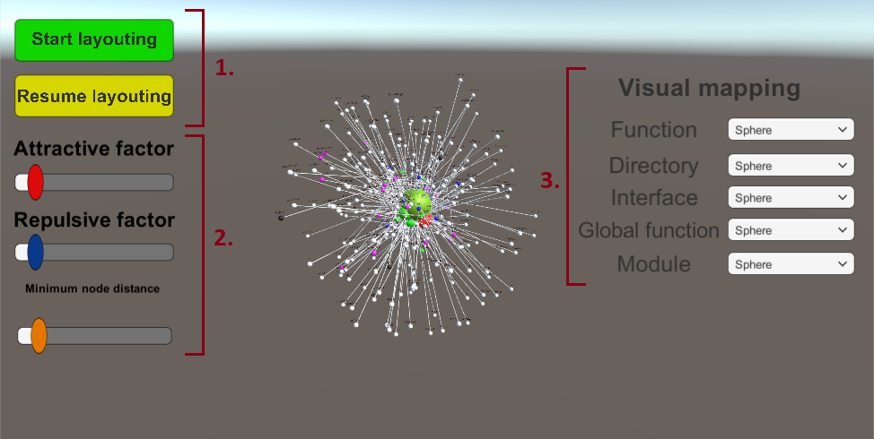

= 🖥️ Desktop

Na interakciu so scénou je možné použiť klávesnicu a myš. Pohyb po scéne je riešený
klávesami W (dopredu), A (doľava), S (dozadu) a D (doprava). Otáčanie kamery je
umožnené pohybom myši v smere želaného otočenia.

Táto scéna disponuje grafickým používateľským rozhraním. Jeho zobrazenie a
skrytie sa vykonáva stlačením klávesy M. Toto používateľské rozhranie poskytuje viacero
funkcií.

== Ovládanie

. *Layout control* - tlačidlá pre spustenie a zastavenie layoutovania grafu.
. *Layout settings* - posuvníky nastavení pre Fruchterman-Reinfoldový layoutovací algoritmus
 (červený - nastavenie veľkosti príťažlivej sily, modrý - nastavenie odpudivej sily,
 oranžový - nastavenie minimálnej dĺžky hrán grafu).
. *Visual mapping* - nastavenie vizuálneho mapovania jednotlivých typov uzlov. Pre každý je možné zvoliť rôzne geometrické útvary.

Pri zobrazení menu otáčanie kamery zablokované a myšou je možné:

* *LMB* - označit objekt.
* *CTRL + LMB* - označit viacero objektov.
* *SRCOLL* - zoomovať k / od onačeného(ných) objekt(ov).
* *MMB + pohyb myši* - krúženie okolo označeného(ných) objekt(ov).

Ďalšie klávesy akcií:

* *P* - zapnutie a vypnutie gravitácie.
* *G* - zapnutie a vypnutie hýbania grafu za uzol.
* *F* - zapnutie a vypnutie fyziky.
* *V* - zmena layoutovania grafu.
* *B* - layoutovanie grafu na plochu.
* *K* - prepínanie medzi vizualizovanim uzlov kockou a guľou.
* *J* - prepínanie medzi vizualizovanim hrán kužeľom a hranolom.
* *I* - skrytie hrán grafu.
* *+* - zväčšenie grafu.
* *-* - zmenšenie grafu.
* *O* - označenie všektých popiskov.
* *PgUp* - priblíženie sa k zdrojovému uzlu.
* *PgDn* - priblíženie sa k cieľovému uzlu.
* *Home* - priblíženie sa k označenému uzlu.
* *Z* - zoom-to-fit (priblíženie / oddialenie kamery tak, aby bol viditeľný celý graf).