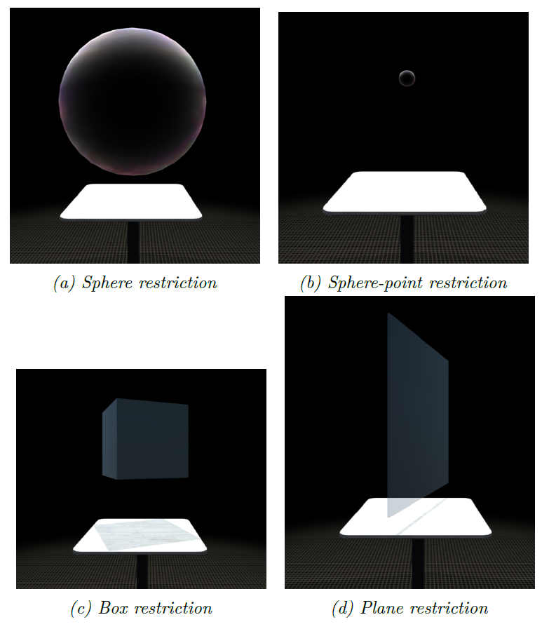
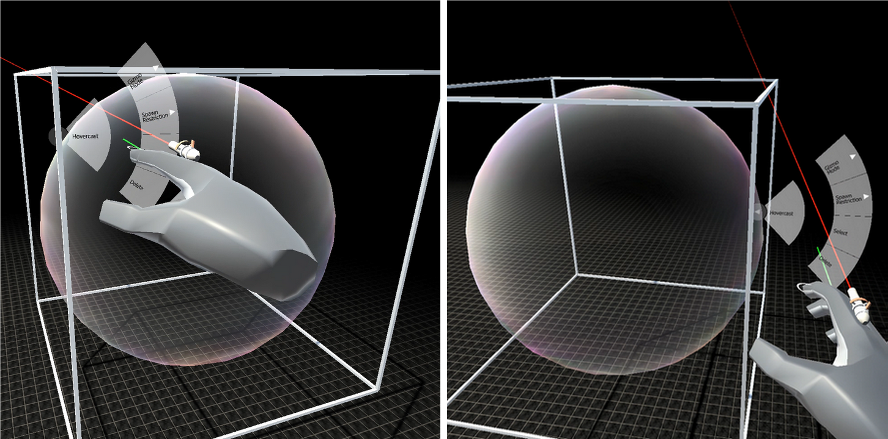
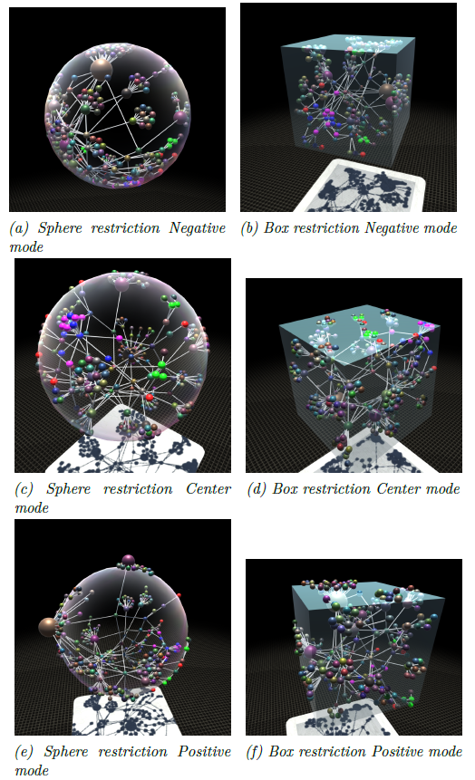
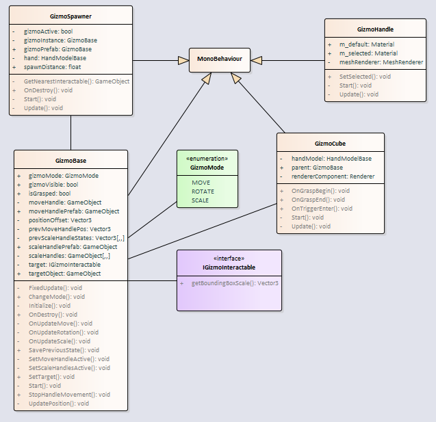
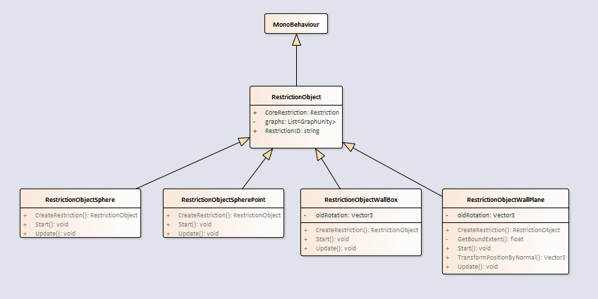
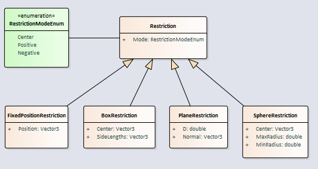

= ⛓️ Obmedzovače a gizmá

== Všeobecný opis (motivácia)

Natívne funkcie, ktoré sa nachádzajú v Leap core moduloch pre Unity, poskytujú jednoduchú interakciu rukami, ako napríklad uchopenie alebo ťahanie objektov, avšak táto funkcionalita je pomerne obmedzená. Taktiež tieto moduly často nestačia čo sa týka presnosti, hlavne v prípade takýchto rozsiahlych grafov, s akými v tomto projekte pracujeme. Chceme docieliť aby používateľ mohol pohodlne a intuitívne pracovať s grafom, prípadne v budúcnosti s grafmi, pričom celá interakcia bude založená na gestách. Používateľ taktiež potrebuje v každom momente poznať s akým uzlom, časťou grafu alebo celým grafom aktuálne pracuje. Práve tu prichádzajú do úvahy gizmá a obmedzovače, ktoré sú v projekte implementované.

Gizmo je jednoduchý kváder, ktorý sa zobrazí okolo objektu v grafe a poskytuje používateľovi možnosť vykonávať nad daným objektom (alebo skupinou objektov) rôzne transformácie ako napríklad presúvanie, rotáciu, škálovanie.

Obmedzovač je objekt, ktorý pomáha vybrať skupinu objektov a re-layoutovať (reorganizovať) ich. K dispozícii sú aktuálne 4 typy a to guľa, guľový bod, kocka a doska. 

== Gizmá - bližšia špecifikácia

Aktuálne je v assetoch pre Unity možné nájsť také, ktoré podobnú funkcionalitu poskytujú pre väčšinu typov objektov, tieto riešenia sa väčšinou spoliehajú na shadery, ktoré tieto gizmá vykreslujú počas post-processingu, teda potom, čo bola celá scéna už dávno vykreslená. Toto je dobré v prípade ovládania myšou, nakoľko myš bude vždy vykresľovaná nad všetkým ostatným. V našom prípade je to však nepoužiteľné, nakoľko ruky sú fyzicky prítomné v samotnej scéne a môžu interagovať iba s inými objektami v scéne. V jednoduchosti to znamená to, že tieto gizmá by boli vždy renderované nad rukami, čo by jednoznačne pokazilo akúkoľvek simuláciu hĺbky nášho priestoru pre používateľa.

Z pohľadu funkcionality sú aktuálne implementované dva typy giziem. Gizmo, ktoré dokáže objektom pohybovať a rotovať a gizmo, ktoré dokáže daný objekt škálovať.

=== Gizmo na hýbanie a rotáciu objektu

Tento typ gizma je zobrazený v prípade priblíženia sa rukou k interagovateľnému objektu. Vizuálne sa zobrazí ako skupina bielych hrán v tvare kocky okolo daného objektu. Po zobrazení vieme jeho uchopením objekt rotovať alebo presúvať. V prípade, že je v blízkosti ruky viacero objektov, gizmo sa zobrazí okolo najbližšieho z nich. Vedľa aktívneho gizma sa zobrazuje UI element, ktorý je zobrazený na obrázku nižšie.

Počas toho ako používateľ prechádza cez menu, algoritmus na zobrazovanie gizma je pozastavený, aby nedošlo k tomu, že keď používateľ prekročí minimálnu vzdialenosť od elementu, potrebnú pre zobrazenie gizma, samotné gizmo a jeho UI zmiznú.

Samotná kocka gizma je predstavovaná skupinou úzkych blokov, ktoré sú zoskupené pod jedným prázdnym elementom, aby bolo možné ich automaticky škálovať naraz ako jeden objekt. Rovnako je tomu tak aj v prípade gizma pre škálovanie. 

Layoutovanie grafu je počas transformácie objektu prostredníctvom gizma pozastavené, aby sme predišli zbytočne náročným operáciám.

=== Gizmo na škálovanie objektu

Tento typ gizma umožňuje škálovať objekt po rôznych kombináciách osí. Pri používaní tohto gizma sa okolo objektu zobrazí 26 ovládacích kociek, ktoré spolu formujú celú kocku. Uchopením a ťahaním týchto kociek je možné daný objekt škálovať.

=== UI

Keď je gizmo aktívne, zobrazí sa pri ňom samostatné UI, ktoré ponúka používateľovi akcie, súvisiace s daným gizmom. Tie sú selekcia, deselekcia a odstránenie. Taktiež je možné prostredníctvom tohto rozhrania zmeniť typ gizma. Toto rozhranie sa zobrazí vždy na bode na hrane gizma, ktorá ja k používateľovej ruke najbližšie. Keď je používateľova ruka v blízkosti tohto rozhrania, jeho presúvanie sa pozastaví, aby mohol používateľ s UI pracovať a neuskakovalo pred tým podľa pohybu jeho ruky. (viď Mura s. 44)

== Obmedzovače – bližšia špecifikácia

Aktuálne sú teda implementované 4 typy obmedzovačov a to:

* guľa (sphere)
* guľový bod (sphere point)
* kocka (box/cube)
* doska (plane)

Potrebné je poznamenať, že guľový bod je v skutočnosti guľa v malej veľkosti, čo znamená, že v nej nie je miesto pre rozloženie objektov, takže pri použití budú cez seba. To je dobré v prípade, že potrebujeme zoskupiť nejaké množstvo objektov bez toho, aby sme ich neskôr chceli skúmať.

Obmedzovač môže mať 3 módy. Prvým je negatívny mód, kedy sa objekty vnútri obmedzovača, dotýkajúce sa okraja prilepia na okraj zvnútra. Druhý mód je taký, že sú tieto objekty v polovici preseknuté hranou a teda polovica je vo vnútri a polovica vonku. Tretí je pozitívny mód, kedy sú tieto objekty prilepené na hrane zvonka. Najlepšie je to možné pozorovať na obrázku nižšie.

== Technická dokumentácia

=== Gizmá

Na nasledujúcom diagrame tried sa nachádza štruktúra priečinka, v ktorom sú implementované gizmá (3DSoftviz\UnityProject\Assets\Scripts\Gizmo)

V prípade, že chceme aby bolo možné s objektom interagovať prostredníctvom gizma, musí tento objekt implementovať interface _IGizmoInteractable._ Ten obsahuje dve metódy:

_getBoundingBoxScale()_ – na základe Vector3 určí veľkosť požadovaného gizma, aby bol cieľový objekt obalený presne

_getSpawnDistance()_ – minimálna vzdialenosť ruky od daného objektu na to, aby sa gizmo zobrazilo

_GizmoSpawner_ skript je vložený v Leap hand modeli. V tomto skripte sa prechádzajú všetky interagovateľné objekty v scéne a určí najbližší k aktuálnej pozícii ruky. Týmto spôsobom sa docieli, že v jednom čase sa môže gizmo nachádzať iba nad jedným objektom.

_GizmoBase_ skript je vložený do prázdneho rodičovského objektu, v ktorom sa nachádzajú bloky pre vykreslenie kocky. Tento skript obsluhuje väčšinu logiky týkajúcej sa giziem. Zároveň si pamätá cieľový objekt (napríklad uzol) a aktualizuje jeho pozíciu podľa pozície gizma.

_InteractionBehavior_ je komponent pripojený na kocku gizma a zabezpečuje uchopenie a pohyb pomocou Leap ruky.

_setNodePosition()_ je funkcia na vrstve LuaInterface, ktorú je potrebné zavolať po skončení posúvania objektu pomocou gizma.

=== Obmedzovače

Na nasledujúcom diagrame je možné vidieť štruktúru priečinka RestrictionObjects v Unity projekte (3DSoftviz\UnityProject\Assets\Scripts\RestrictionObjects)

Na druhom diagrame je možné vidieť štruktúru priečinka Restrictions v GraphCore projekte (3DSoftviz\CSProjects\GraphCore\Restrictions).

== Testy

Testy sa k tejto časti funkcionality projektu aktuálne nenachádzajú. Je teda potrebné nejaké navrhnúť a doimplementovať a následne budú vložené do tejto dokumentácie.