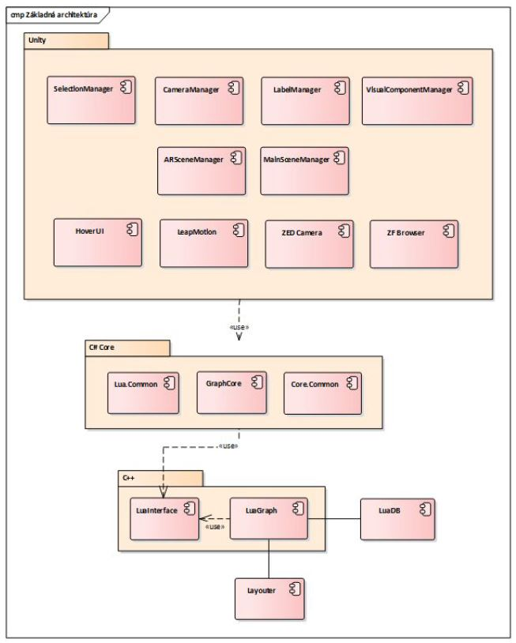
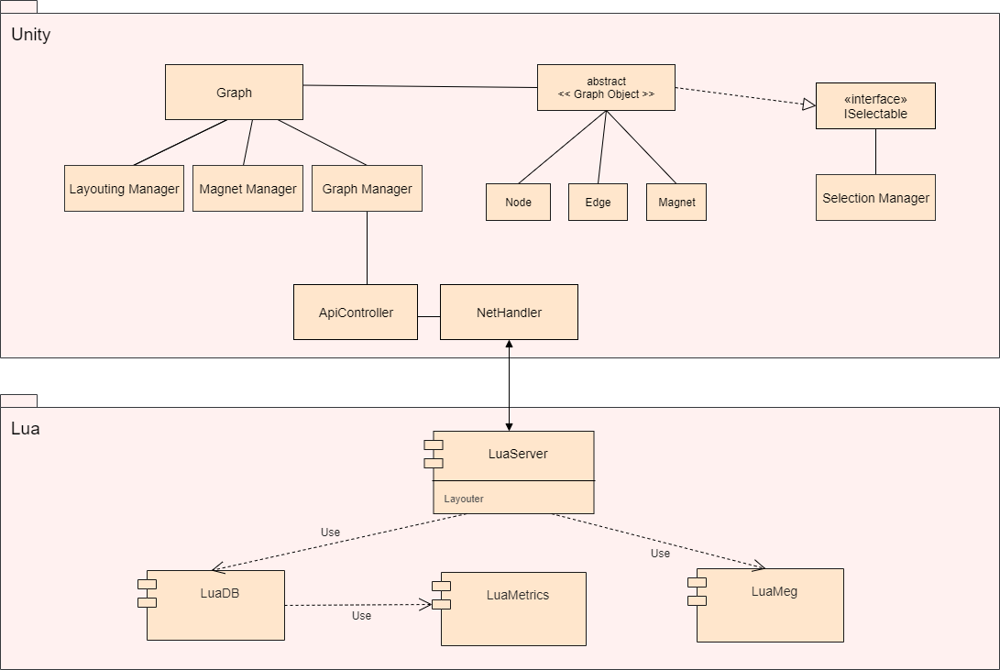

# Architektúra systému

## Celkový pohľad na systém

Kapitola obsahuje opis základnej architektúry projektu, jednotlivé vrstvy a ich moduly. Všetky moduly majú vybudovanú infraštruktúru,
ktorá zahŕňa kompiláciu, testovanie, coverage, generovanie dokumentácie zo zdrojového kódu a jej export na vzdialený server.

### Základná architektúra

Architektúra projektu je zložená zo 4 vrstiev.  
Na najnižšej vrstve sa nachádzajú moduly jazyka Lua. Tieto moduly priamo narábajú s
reprezentáciou grafových údajov a vykonávajú nad nimi operácie.  
Druhá vrstva je reprezentovaná programovacím jazykom C++. Na tejto vrstve sú implementované 2 moduly, ktoré slúžia ako rozhranie
pre moduly jazyka C# pre prácu s najnižšou vrstvou, t.j. modulmi jazyka Lua.  
Tretia vrstva je tvorená modulmi jazyka C#, ktoré poskytujú rozhranie pre Unity vrstvu, prostredníctvom ktorej je možné pracovať
s nižšími vrstvami.  
Najvyššia vrstva je reprezentovaná Unity, ktoré poskytuje grafickú reprezentáciu nižších vrstiev.  

Architektúru projektu je možné vidieť na obrázku nižšie.

Refactor architektúra je uvedená na nasledujúcom obrázku.

### Lua

Na tejto vrstve sa nachádza reprezentácia grafových údajov. Jednotlivé operácie nad grafom sú teda vykonávané na tejto vrstve.
Vo všeobecnosti teda dochádza k prepočítavaniu a zmenám súradníc uzlov, analýze zdrojového kódu a počítaniu metrík. Bližšie
informácie o generovaní grafu je možné nájsť v
[dokumentácii generovania grafu](../funkcionalita_systemu/generovanie_grafu/analyza_lua3Dsoftviz.md).  
S touto vrstvou úzko súvisí tiež jazyk Terra, v ktorom je implementovaný layoutovací algoritmus Fruchterman-Reingold. Na tejto vrstve
je tiež možné analyzovať Moonscript projekty. Vrstva ďalej poskytuje funkcionalitu pre generovanie UML a sekvenčných diagramov.  
Vrstva je celkovo tvorená 5 modulmi.

#### Luadb
Logika modulu Luadb priamo súvisí s tvorbou grafu. Obsahuje reprezentáciu hrán, uzlov a metauzlov. V rámci modulu sú tiež implementované operácie,
ktoré je možné nad grafom vykonávať. Bližší popis modulu a layoutovacieho algoritmu je možné nájsť v
[dokumentácii Lua modulov](moduly_systemu/lua.md).  
Modul má vybudovanú [infraštruktúru](../infrastruktura/ci/lua/luadb.md) a vlastný [build systém](../infrastruktura/build/lua/luadb.md).

#### Luametrics
Modul Luametrics vykonáva analýzu zdrojového kódu a produkuje AST, spolu s metrikami.  
Modul má vybudovanú [infraštruktúru](../infrastruktura/ci/lua/luametrics.md) a vlastný
[build systém](../infrastruktura/build/lua/luametrics.md).

#### Luameg
Úlohou modulu je vytváranie UML a sekvenčných diagramov zo zdrojových kódov. Modul podporuje jazyky Lua a Moonscript. Bližšie informácie k
jednotlivým diagramom je možné nájsť v dokumentácii [UML diagramov](../funkcionalita_systemu/uml_diagramy.md).  
Modul má vybudovanú [infraštruktúru](../infrastruktura/ci/lua/luameg.md) a vlastný [build systém](../infrastruktura/build/lua/luameg.md).

#### Luatree
Luatree je balík nástrojov na analýzu a inšpekciu AST, ktoré produkuje modul Luametrics, a grafov volaní funkcií vytváraných modulom Luadb.  
Modul má vybudovanú [infraštruktúru](../infrastruktura/ci/lua/luatree.md) a vlastný [build systém](../infrastruktura/build/lua/luatree.md).

#### Luagit
Modul Luagit slúži na analýzu Git repozitárov, pričom k svojej činnosti využíva moduly Luametrics a Luadb.  
Modul má vybudovanú [infraštruktúru](../infrastruktura/ci/lua/luagit.md) a vlastný [build systém](../infrastruktura/build/lua/luagit.md).

#### Luaserver
Modul Luaserver slúži ako server, ktorý k svojej činnosti využíva moduly ostatné moduly Lua. Jeho hlavnou funkcionalitou je komunikácia s Unity klientom, ale mimo toho sú v rámci tohto modulu implementované layoutovacie algoritmy ako Fruchterman-Reingold, City, CityFR alebo Street. Zároveň obsahuje operátory na zmenu atribútov pre uzly a hrany. Modul má vybudovanú [infraštruktúru](../infrastruktura/ci/lua/luaserver.md).

### C++

Druhá vrstva, reprezentovaná programovacím jazykom C++, slúži ako rozhranie pre C# moduly, aby mohli komunikovať s Lua modulmi a získavať
tak grafové údaje, prípadne nad týmito údajmi vykonávať operácie. Vrstva zahŕňa 2 moduly. Bližšie informácie o týchto moduloch
je možné nájsť v [dokumentácii C++ modulov](moduly_systemu/cplusplus.md).

#### LuaInterface
Modul slúži ako rozhranie medzi C# a Lua modulmi. Poskytuje metódy pre volanie Lua funkcií a získavanie informácií.  
Modul má vybudovanú [infraštruktúru](../infrastruktura/ci/cplusplus/luainterface.md) a vlastný
[build systém](../infrastruktura/build/cplusplus/luainterface.md).

#### LuaGraph
Úlohou modulu je načítať grafové údaje modulu Luadb a poskytovať ich vyšším vrstvám.  
Modul má vybudovanú [infraštruktúru](../infrastruktura/ci/cplusplus/luagraph.md) a vlastný
[build systém](../infrastruktura/build/cplusplus/luagraph.md).

### C# #

Programovací jazyk C# predstavuje pomyselnú tretiu vrstvu. C# moduly sú priamo využívané vyššou vrstvou. Tieto moduly zabezpečujú prístup k
metódam C++ modulov a tiež umožňujú pracovať s grafovými údajmi. Na tejto vrstve obsahuje projekt 2 moduly. Bližší popis modulov
je možné nájsť v [dokumentácii C# modulov](moduly_systemu/csharp.md).  
[Infraštruktúra](../infrastruktura/ci/3dsoftviz_remake.md) a [build systém](../infrastruktura/build/3dsoftvis_remake.md) sú združené pre všetky C# moduly.

#### Lua.Common
Modul poskytuje prístup k C++ metódam, ktoré sú exportované vo forme DLL `LuaGraph` a `LuaInterface`. Modul obsahuje viaceré pomocné metódy,
ktoré zjednodušujú reprezentáciu údajov, prípadne vykonávajú konverziu. Modul ďalej obsahuje viacero atribútov, ktoré zjednodušujú
načítavanie polí, štruktúr a reťazcov.

#### GraphCore
V module je obsiahnutá logika súvisiaca s grafovými údajmi. Modul umožňuje prácu s grafom, načítavanie jeho aktuálneho stavu,
polohy, prípadne iných špecifických vlastností.

### Unity

Unity predstavuje najvyššiu vrstvu, ktorá slúži na zobrazovanie a manipuláciu grafových údajov prostredníctvom rozhraní nižších
vrstiev. Údaje nižších vrstiev graficky reprezentuje. Logika práce Unity s grafovými údajmi je popísaná v
[dokumentácii generovania grafu](../funkcionalita_systemu/generovanie_grafu/analyza_unity.md).  
Vrstva zahŕňa viacero modulov. Bližší popis jednotlivých modulov je možné nájsť v [dokumentácii Unity modulov](moduly_systemu/unity.md).
