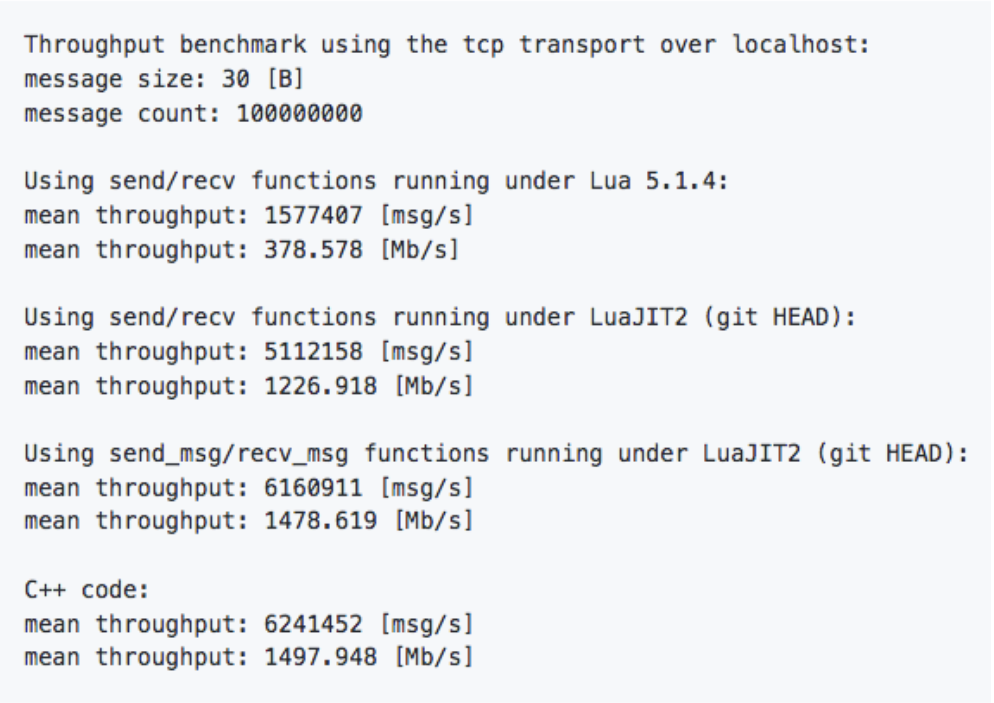

# Možnosti komunikácie medzi procesmi

Kvôli problémom s kompabilitou medzi platformami je vhodné, ak ďalší vývoj projektu
bude smerovať ku komunikácii medzi procesmi prostredníctvom IPC alebo RPC.  
Cieľom je tak úplne izolovať časť, ktorá pre svoju
činnosť vyžaduje programovacie jazyky Lua a Terra. Táto časť bude kontajnerizovaná. Kontajner
bude obsahovať interpreter `LuaJIT` z distribúcie `Luapower`. Kontajner bude ďalej obsahovať
všetky závislosti a Lua moduly potrebné k činnosti. Potrebné je tak zabezpečiť komunikáciu
medzi kontajnerom a hostiteľským systémom. Taktiež je nevyhnutné navrhnúť spôsob serializácie
údajov.  

Do budúcna je možné túto komunikáciu riešiť buď na úrovni komunikácie v rámci lokálneho stroja, alebo
je možné upraviť projekt tak, aby využíval vzdialený server. Z hľadiska povahy tejto komunikácie je
potrebné zabezpečiť vysokú priepustnosť.  

Kontajner by bol založený na [Lua CI Image](../infrastruktura/ci/gitlab_images/lua.md), ktorý je použitý
taktiež vo vývojovom prostredí [Devenv](../infrastruktura/podporne_nastroje/devenv.md). V kontajneri by teda bežal 
[Layouter](moduly_systemu/lua.md), ktorý by prepočítaval súradnice. Tie by potom poskytoval C# modulu
[GraphCore](moduly_systemu/csharp.md). Týmto spôsobom je možné zároveň projekt odľahčiť, nakoľko by
nebolo potrebné využívať [C++ moduly](moduly_systemu/cplusplus.md), ktoré sprostredkúvajú komunikáciu
medzi C# a Lua vrstvou.

## Komunikácia

Komunikáciu medzi kontajnerom a hostiteľským systémom je v princípe možné vykonať buď
medziprocesovou komunikáciou (IPC), alebo vzdialeným volaním procedúr (RPC). Zároveň
je potrebné brať do úvahy kompatibilitu medzi platformami. Nakoľko kontajner využíva
operačný systém Linux Ubuntu, nie je možné zabezpečiť kompatibilitu so všetkými
paradigmami.  

Z hľadiska rýchlosti sú jednotlivé paradigmy zoradené zostupne od najrýchlejšej po najpomalšiu :

- Zdieľaná pamäť (shared memory/shm)
- Message Queue
- Unix domain sockets
- Pipe
- FIFO (named pipe)
- TCP socket

Dôležité je poznamenať, že rozdiel medzi FIFO a TCP socketmi predstavuje približne 16%.  

Ako bolo vyššie uvedené, kvôli kompatibilite nie je možné použiť všetky paradigmy. Z hľadiska
kompatibility je najvýhodnejšie použitie TCP socketu. Prostredníctvom TCP socketu je následne
možné prejsť na použitie vzdialeného servera bez potreby modifikácie klientskej časti.  

Na zabezpečenie komunikácie existuje viacero knižníc, ktoré sa líšia rýchlosťou, podporovanými
vzormi komunikácie, prípadne použitím brokerov (centrálnych uzlov). Pre potreby projektu je
nevyhnutné, aby bola dostupná knižnica pre programovacie jazyky Lua a C#.

### ZeroMQ

[ZeroMQ](https://zeromq.org/) (tiež známe ako ØMQ, 0MQ, alebo zmq) predstavuje rámec, ktorý
umožňuje prenášať správy medzi viacerými uzlami. Podporuje viaceré spôsoby prenosu - v rámci
procesu, medzi procesmi, TCP a multicast.  

ZeroMQ ďalej implementuje mechanizmus `High Water Mark`, ktorý predstavuje pevný limit maximálneho
počtu správ v rade, po naplnení ktorého dôjde k blokovaniu alebo zahadzovaniu ďalších prijatých správ.  

Výhodou riešenia je kvalitná [dokumentácia](https://zeromq.org/get-started/). K dispozícii je ako verzia
pre jazyk [C#](https://github.com/zeromq/netmq), tak aj pre jazyk Lua. [Lua-zmq](https://github.com/Neopallium/lua-zmq)
predstavuje binding nad ZeroMQ verzie 2. Knižnica [Lzmq](https://github.com/zeromq/lzmq) je binding
nad verziami 3 a 4.  
Obe knižnice je možné inštalovať prostredníctvom správcu `Luarocks`.  

V spojení s interpreterom `LuaJIT` by mal rámec poskytovať dostatočnú rýchlosť aj pri komunikácii
prostredníctvom TCP socketu. Podľa dostupných informácii je možné dosiahnuť rýchlosť
až 1 478.619 Mb/s.  



V repozitároch [Lzmq-guide](https://github.com/moteus/lzmq-zguide) a [Zguide](https://github.com/booksbyus/zguide)
je možné nájsť viacero ukážkových implementácií pre rôzne programovacie jazyky.  

Nižšie je možné vidieť ukážkové riešenie jednoduchej klient-server komunikácie prostredníctvom Unix domain socketov.
Server bol vytvorený v jazyku C a klient v jazyku Lua.

```c
//  C Hello World server

#include <zmq.h>
#include <stdio.h>
#include <unistd.h>
#include <string.h>
#include <assert.h>

int main (void)
{
    //  Socket to talk to clients
    void *context = zmq_ctx_new ();
    void *responder = zmq_socket (context, ZMQ_REP);
    int rc = zmq_bind(responder, "ipc:///src/test");
    assert(rc == 0);

    while (1) {
        char buffer [10];
        zmq_recv (responder, buffer, 10, 0);
        printf ("Received Hello\n");
        sleep (1);          //  Do some 'work'
        zmq_send (responder, "World", 5, 0);
    }
    return 0;
}
```

```lua
--
--  Lua Hello World client
--  Sends "Hello" to server, expects "World" back
--
--  Author: Robert G. Jakabosky <bobby@sharedrealm.com>
--
local zmq = require "lzmq"

local context = zmq.init(1)

--  Socket to talk to server
print("Connecting to hello world server…")
local socket = context:socket(zmq.REQ)
socket:connect("ipc:///src/test")

for n=1,10 do
    print("Sending Hello " .. n .. " …")
    socket:send("Hello")

    local reply = socket:recv()
    print("Received World " ..  n .. " [" .. reply .. "]")
end
socket:close()
context:term()
```

ZeroMQ poskytuje tiež viacero vzorov komunikácie :  

#### Request-reply
Prepojenie množiny klientov s množinou služieb. V tomto prípade sa jedná o RPC a model distribúcie úloh.  

#### Publish-subscribe
Vzor prepája množinu producentov s množinou konzumentov. Ide o model distribúcie údajov.  

#### Pipeline
Potrubie, ktoré spája viacero uzlov. Môže mať viacero krokov a slučiek. Jedná sa o model paralelnej
distribúcie a zberu.  

#### Exclusive pair
Vzor prepája práve 2 sockety. Ide o model prepojenia dvoch vláken v procese.

## Serializácia

Pred samotným odoslaním je potrebná serializácia údajov. Čím efektívnejšia bude serializácia, tým efektívnejšie
môže prebiehať celá komunikácia, obzvlášť pokiaľ by výsledné riešenie komunikovalo so vzdialeným serverom.  
Medzi najbežnejšie formáty údajov patrí JSON a XML. Existuje viacero knižníc pre jazyky C# aj Lua.  

### JSON

[JSON](https://www.json.org/json-en.html) predstavuje jednoduchý formát na výmenu údajov. Patrí medzi pomerne
ľahko čitateľné a zapisovateľné notácie. Má taktiež širokú podporu. Je založený na 2 základných štruktúrach, a to
kolekcia párov kľúč-hodnota (objekt, záznam, štruktúra, slovník a pod.) a usporiadaný zoznam hodnôt (pole, vektor,
zoznam a pod.).  
Pre programovací jazyk Lua je možné použiť knižnicu priamo z distribúcie Luapower, konkrétne
[CJSON](https://github.com/luapower/cjson).

### MessagePack

[MessagePack](https://msgpack.org/) je rámec na serializáciu údajov. Podobne ako JSON, umožňuje výmenu údajov
medzi viacerými uzlami a programovacími jazykmi. Oproti formátu JSON by mal byť MessagePack efektívnejší a rýchlejší,
nakoľko serializované údaje majú menšiu veľkosť.  
Menšia veľkosť so sebou prináša aj niekoľko obmedzení, ktoré sa týkajú možnej veľkosti údajových typov. Jednotlivé
obmedzenia, rovnako ako aj podporované údajové typy je možné nájsť v
[špecifikácii](https://github.com/msgpack/msgpack/blob/master/spec.md).  
Pre programovací jazyk Lua je k dispozícii knižnica [lua-MessagePack](https://github.com/markstinson/lua-MessagePack),
ktorá by mala byť podľa autora rýchla v kombinácii s interpreterom `LuaJIT`. Rovnako aj túto knižnicu je možné
inštalovať prostredníctvom `Luarocks`.  
Pre C# je potom k dispozícii knižnica [msgpack-cli](https://github.com/msgpack/msgpack-cli).

## Ukážka RPC
Repozitár 3DSoftviz obsahuje adresár examples, v ktorom sa nachádza ukážka možností implementácie mechanizmov 
RPC s použitím ZeroMQ a MessagePack.  
Za týmto účelom bol modifikovaný [Lua CI Image](../infrastruktura/ci/gitlab_images/lua.md), ktorý obsahuje všetky 
potrebné závislosti.  
Ukážka obsahuje jednoduchú implementáciu serverovej časti v jazyku Lua a klientskej časti v jazyku C#.  
Serverová časť počúva na porte TCP/49155. Prijatá správa je následne rozbalená prostredníctvom knižnice MessagePack. 
Rozbalená správa má potom formu tabuľky, ku ktorej obsahu je možné pristupovať prostredníctvom číselných indexov. 
V ukážke sa očakáva správa v nasledujúcom tvare.
```lua
local message = {}
message[1] = "command"
message[2] = "params"
message[3] = "result"
```
Všetky atribúty tabuľky sú reprezentované vo forme reťazcov.  
Jednotlivé lokálne funkcie sú uložené v tabuľke s názvom `_L`, čím je možné zabezpečiť volanie funkcie na základe jej názvu 
vo forme reťazca. Rovnakým spôsobom je možné uchovávať tiež lokálne premenné.
```lua
local _L = {}
_L["extract"] = extract
```
Pre účely ukážky bola vytvorená funkcia s názvom `extract`, ktorá spracováva parametre a následne volá funkciu extractor.extract, 
ktorej výstup je odovzdaný vo forme návratovej hodnoty.
```lua
local function extract(params)
  local path = params[1]
  return extractor.extract(path, astMan)
end
```
Funkcia je potom volaná bezpečným spôsobom prostredníctvom funkcie `pcall`. Funkcií sú tiež odovzdané požadované parametre.
```lua
local command = message[1]
local params = message[2]
local status, result = pcall(_L[command], params)
```
Pokiaľ atribút `command` obsahuje reťazec "end", dôjde k nastaveniu premennej cyklu na hodnotu false, server upovedomí 
klienta a program skončí.
```lua
if command == "end" then
    loop = false
    request[3] = "Server stopping"
    socket:send(mp.pack(request))
    break
end
```
Do atribútu `result` môže byť vložený výsledok. Pre účely ukážky je atribút reprezentovaný vo forme reťazca. Do 
budúcna by však bolo vhodnejšie tento atribút reprezentovať na klientskej strane vnoreným objektom, takže na 
strane servera by mal atribút formu vnorenej tabuľky. Odpoveď je následne odoslaná klientovi.
```lua
message[3] = json.encode(result)
socket:send(mp.pack(message))
```
Klientska časť je implementovaná v programovacom jazyku C#. Na úspešnú komunikáciu medzi klientskou a serverovou časťou 
s využitím serializácie prostredníctvom knižnice MessagePack, je potrebné vytvoriť objektové štruktúry, ktoré budú 
dodržané ako na klientskej, tak aj serverovej strane. Dodržanie štruktúry sa týka hlavne použitých údajových typov. 
Štruktúra objektu, ktorý je mapovaný na tabuľku uvedenú vyššie je možné vidieť na nasledujúcej ukážke.
```c#
public class RemoteCall
{
    public string functionName { get; set; }
    public string[] functionParams { get; set; }
    public string result { get; set; }
}
```
Atribút `functionName` zodpovedá atribútu označenému ako `command`, `functionParams` zodpovedá `params` a `result` je mapovaný na `result`.  
Takýmto spôsobom je možné zabezpečiť bezproblémové mapovanie C# objektov na tabuľku v jazyku Lua. Rovnako je bezproblémové 
spätné mapovanie tabuľky na C# objekt, ku ktorého atribútom je možné pristupovať štandardnou bodkovou notáciou.
```c#
MessagePackSerializer serializer = MessagePackSerializer.Get(rpc.GetType());
MemoryStream toUnpack = null;

byte[] responseFromServer = client.ReceiveFrameBytes();
toUnpack = new MemoryStream(responseFromServer);
RemoteCall unpacked = (RemoteCall)serializer.Unpack(toUnpack);
Console.WriteLine(unpacked.result);
```
### Spustenie
Na spustenie ukážky je potrebné prostredie Docker a IDE Visual Studio.  
Pre spustenie serverovej časti ukážky je potrebná inštalácia vývojového prostredia 
[Devenv](../infrastruktura/podporne_nastroje/devenv.md). Je teda potrebné postupovať podľa krokov uvedených v dokumentácii.  
Repozitár obsahujúci súbory potrebné pre vývojové prostredie devenv by mali byť naklonované do rovnomenného adresára, t.j. devenv. 
Tento adresár po úspešnej inštalácii obsahuje ďalej adresár luadev. Do tohto adresára je potrebné naklonovať repozitár 
[3DSoftVis_Remake](https://gitlab.com/FIIT/3DSoftVis_Remake/3dsoftvis_remake). Pre spustenie serverovej časti je potrebné prejsť 
do adresára `examples/rpc` a následne príkazom `lua server.lua` program spustiť.

- !!! tip "Tip"
    - Na spustenie nie je potrebné klonovanie celého repozitára. Pokiaľ už repozitár bol naklonovaný, stačí nakopírovať 
    adresár `examples` do adresára `luadev`.

Na spustenie klientskej časti je potrebné otvoriť súbor `examples/rpc/Lua_rpc/Lua_rpc.sln`. Solution je potrebné následne 
v IDE Visual Studio zostaviť a spustiť.

### Poznámka
Ako testovací vstup je v súčasnosti pre účely ukážky použitý Moonscript projekt. Použitie Lua projektu momentálne nie je možné, 
pravdepodobne kvôli vzniku cyklov vo výslednom grafe, v dôsledku čoho nie je možné nad týmito údajmi vykonať serializáciu ani 
prostredníctvom knižnice ZeroMQ, ani CJSON. Po odstránení cyklov by so serializáciou nemal byť problém.  
Tento problém sa vyskytuje pri priamom volaní funkcie `extractor.extract`, ktorá je súčasťou submodulu `luadb.extraction.extractor`.

## LuaServer
Aktuálne je v module luaserver využívaná knižnica MessagePack, ZeroMQ na komunikáciu a CJSON na serializáciu správ.
LuaServer je samostatný repozitár na GitLabe, ktorý je zahrnutý aj vo vývojovom prostredí devenv na vetve 
feature/krocka-include-luaserver. Väčšina funkcionality sa v tomto momente nachádza na vetve feature/souc-luaserver.

## Poznámky
K dipozícii je viacero vývojových rámcov umožňujúcich komunikáciu medzi viacerými uzlami. Jedným z riešení
môže byť [gRPC](https://grpc.io/), ktoré však nemá k dispozícii oficiálnu knižnicu pre jazyk Lua.  

Ďalšou alternatívou môže byť komunikácia prostredníctvom [JSON-RPC](https://www.jsonrpc.org/specification).
Údaje by sa prenášali vo formáte JSON. Nižšie je možné vidieť ukážkové volania.

```json
{"method":"doString","params":["asd = {ma=12,mk=45}"], "id":12}
{"method":"doString","params":["asd = \"asd\\nxncbv\""], "id":13}
{"method":"getObject","params":["asd"], "id":14}


{"method":"doString","params":["aasd()"]}
{"method":"doString","params":["gr = getGraph(0)"]}
{"method":"getObject","params":["gr"]}


{"method":"doString","params":["aasd()"]}
{"method":"doString","params":["UMLVALUE = getSequenceDiagram(0, 68)"]}
{"method":"getString","params":["UMLVALUE"]}

{"method":"doString","params":["print(\"asd\\nxncbv\")"], "id":13}
```

Viacero užitočných informácií, vrátane implementácie funkcií `doString`, `getString` a `getObject`, rovnako aj použitie exportovaných 
funkcií, je možné nájsť v poznámkach v [OneNote](https://stubask.sharepoint.com/sites/Timovy_Projekt_FIIT/_layouts/OneNote.aspx?
id=%2Fsites%2FTimovy_Projekt_FIIT%2FSiteAssets%2FTimovy_Projekt_FIIT%20Notebook&wd=target%28Ostatn%C3%A9
.one%7C5B6104E8-1473-4F19-9490-62E136ED67CC%2F%29).

### Užitočné linky

- <https://github.com/luapower>
- <https://luarocks.org/modules/neopallium/lua-zmq>
- <https://luarocks.org/modules/moteus/lzmq>
- <http://zguide.zeromq.org/lua:all>
- <https://github.com/zeromq/libzmq>
- <https://github.com/goldsborough/ipc-bench>
- <https://github.com/grpc>
- <https://docs.docker.com/engine/reference/run/#ipc-settings---ipc>
- <https://github.com/msgpack>
- <https://luarocks.org/modules/fperrad/lua-messagepack>
