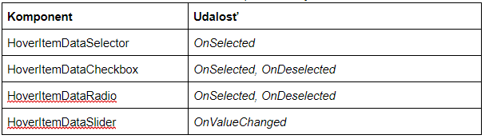

# Unity

Modul tvorí prezentačnú vrstvu celého projektu. Vizualizuje graf analyzovaného zdrojového kódu a umožňuje manipuláciu grafu ako celku aj s jeho jednotlivými vrcholmi a prepojeniami. Graf zobrazuje komplexitu analyzovaného zdrojového kódu a prepojenia medzi modulmi. Rámec Unity si vyžaduje implementáciu skriptov v C#.

Súčasťou tohto modulu sú dodatočné moduly ako podpora vykresľovania vo virtuálnej realite na Oculus Rift alebo HTC Vive a interakciu s grafom pomocou senzoru rúk Leap Motion, vykresľovanie v rozšírenej realite a manipuláciu s grafom sledovaním špeciálnych symbolov pomocou bežnej kamery.

## Actions

Tento modul vytvára jednotný systém pre spúšťanie znovupoužiteľných kusov kódu spúšťané z grafického rozhrania. Je to implementácia Command patternu. Diagram Command patternu je možné vidieť na obrázku nižšie.

Akcie sa spúšťajú pomocou metódy `ActionManager.Start`. `IAction` má svoj životný cyklus `OnStart`, `OnUpdate`, `OnEnd`, `OnCancel`. Taktiež určuje svoju `IActionGroup`. V jeden moment nemôžu prebiehať viaceré akcie z rovnakej `IActionGroup`. Ak sa začne iná akcia, tak sa predošlá zruší a zavolá sa jej `OnCancel`. Akcie majú predvolenú skupinu `ActionGroup.None`, pre ktorú tieto vzájomné vylučovanie neplatí.

Taktiež je zadefinovaná `OneTimeAction`, ktorá je špeciálny prípad `IAction`, ktorá nemá svoj životný cyklus a vykoná sa iba jedenkrát.

## AR Technológie

Na spustenie AR scény sú nutné okrem VR/AR okuliarov 3 technológie. Tie sú:

* LEAP Motion Senzor
* ZED Kamera
* HoverUI Kit

ZED Kamera poskytuje zobrazenie priestoru okolo používateľa. V projekte je použité SDK v2.8. Pred používaním je nutné SDK najprv nainštalovať. To je dostupné na stránke: `https://www.stereolabs.com/developers/`. Kamera dokáže okrem snímania aj vnímať okolie ako 3D priestor vďaka hĺbkovému snímaniu. V projekte sa preto používa primárne na dve veci. Prvou je že dokáže vykonávať “spatial mapping”, čo je vytvorenie digitálneho meshu z prostredia a následne ho aj ukladať. Druhou vlastnosťou je “depth perception”, pri ktorej ZED kamere zadáme dvojrozmerné súradnice a ona nám dokáže vrátiť vzdialenosť kamery od body, na ktorý sa pozeráme. Táto funkcia sa používa na umiestňovanie grafu na vybraný bod.

Do scény sa po nainštalovaní pridá modul, ktorý sa nazýva Zed_Rig_Stereo. Ten slúži namiesto kamery v scéne a taktiež obsahuje komponent ZED Manager, čo je knižnica funkcií ZED kamery. Pokiaľ potrebujeme využiť funkciu tejto knižnice, v skripte si vytiahneme práve tento komponent.

LEAP Motion zabezpečuje sledovanie pohybu rúk. Použite je SDK v2.3.1. Pre inštaláciu je nutné stiahnuť vyššie spomínaný SDK zo stránky: `https://developer.leapmotion.com/get-started/` a nainštalovať. Parametre sú v Unity už prednastavené. LEAP je v tejto scéne primárne kvôli interaktívnemu menu HoverUI.

Na sprístupnenie LEAP senzoru v AR scéne je potrebné na kameru pripnúť LEAP XR Service Priovider a na sprístupnenie rúk treba pridať objekt LEAP Rig do scény.

HoverUI Kit slúži ako interaktívne menu, ktoré je pripnuté na rukách pomocou LEAP senzoru. Inštalácia nie je potrebná, všetky potrebné prostriedky sú už v projekte. Aktivuje sa obrátením ľavej ruky smerom nahor a naviguje sa ním pomocou ukazováka pravej ruky. Pomocou tohto menu sa interaguje so samotným grafom, teda funkcie ako zapnúť layoutovač, zmeniť typy uzlov/hrán alebo sa pomocou neho umiestni graf na miesto, na ktoré sa momentálne používateľ pozerá.

Na pripnutie Hover UI menu na LEAP ruky je potrebné na Leap Rig pripnúť Hover Input Leap Motion.

## Camera Manager

Skript zahŕňa funkcionalitu používanú pri interakcii s kamerou. Zabezpečuje efektívne manipulovanie a pohyb vo vizualizovanom grafe. Medzi hlavnú funkcionalu tejto časti systému patrí približovanie sa ku konkrétnym uzlom (FocusObject), orbitovanie okolo jedného alebo skupiny uzlov (OrbitalMode) a automatické oddialenie kamery do vzdialenosti potrebnej na zobrazenie kompletného grafu (ZoomToFit).

* FocusObject - funkcionalita zabezpečujúca priblíženie kamery ku konkrétnemu uzlu po vykonaní akcie používateľa. Vyvolanie samotnej akcie zabezpečuje metóda ZoomInTo(clickedObjectTransform), ktorej parameter clickedObjectTransform nesie používateľov zvolený objekt. V procese približovania má kamera prednastavené dva stavy - isZoomed a isZooming v závislosti od toho, či je kamera k uzlu priblížená, alebo je v režime približovania (UpdateZoomInTo). Pri tomto režime sú použíté štandardné operácie pre interpoláciu a rotáciu, ktorými Unity disponuje.

* OrbitalMode - orbitálny mód, ktorého úlohou je centrovanie kamery na žiadaný bod a následné orbitovanie. Nemusí ísť nutne o uzol v grafe, funkcionalita ponúka aj orbitovanie okolo ťažiska viacerých vybraných uzlov používateľom.

    *   Selekcia uzla/uzlov: Poskytuje SelectionManager, ktorého metóda GetSelectedObjects() vracia zoznam označených uzlov.
    *   Výpočet ťažiska: Zo zoznamu označených uzlov vykonáva výpočet pozície ťažiska.
    *   Interakcia: Prvým krokom je vycentrovanie kamery na žiadaný bod. Držaním zvoleného tlačidla je možné myšou orbitovať po X-ovej alebo Y-ovej osi.

* ZoomToFit - funkcionalita, ktorá po jej zavolaní oddiali, alebo priblíži kameru od grafu tak, aby sa zmestil na obrazovku. Vyvolanie samotnej akcie zabezpečuje metóda ZoomToFit(). Táto metóda ráta cieľovú pozíciu a natočenie kamery, ktoré musí kamera dosiahnuť, aby sa dosiahol výsledný efekt. V procese približovania / oddiaľovania má kamera prednastavené dva stavy - isZoomed a isZooming v závislosti od toho, či je dosiahnutý cieľový stav kamery, alebo je v režime pohybu k tomuto stavu (UpdateZoomToFit).

Všetky akcie sú aplikované za pomoci Action Patternu a ich vstupy sú spracovávané Input Handlerom.

## HoverUI Kit

K modulu HoverUI Kit patria, v rámci AR scény, herné objekty:

### HoverCast

Herný objekt obsahuje všetky vizuálne vlastnosti, komponenty a definície animácií, ktoré sa dejú pri používaní menu. Vyskytujú sa v ňom 4 objekty:
* OpenItem - definícia tlačidla na otváranie/zatváranie menu.
* TitleItem - obsahuje nastavenie textu pre názov menu.
* BackItem - definícia tlačidla pre krok späť, ktoré sa nachádza sa v strede dlane.
* Rows - aktuálne rozloženie hlavného menu, ktoré môžeme upravovať (prípadne pridávať nové položky).

### HoverMock

Dcérsky herný objekt Mock obsahuje makety všetkých nami používaných typov komponentov v hlavnom menu. Pri vytváraní nových komponentov je možné tieto herné objekty kopírovať, čím sa môžeme vyhnúť zdĺhavému a komplikovanému manuálnemu vytváraniu komponentov prostredníctvom externých HoverBuilderov. Pri nakopírovaní netreba zabudnúť na zmenu názvu herného objektu a jeho vlastností ID a Label (prípadne Navigate To Row pre typ RowSelector, Radio Group ID pre typ Radio, Range Min a Range Max pre Slider).

Tento objekt obsahuje makety komponentov:

* Row - riadok vnoreného menu po kliknutí na RowSelector, ktorý obsahuje konkrétne komponenty.
* RowSelector - komponent typu Selector, ktorý sa stará o navigáciu do vnoreného menu (Row).
* Back - komponent typu Selector, ktorý má za úlohu o navigáciu do rodičovského menu (krok späť).
* Selector - komponent, ktorý sa správa ako klasické tlačidlo - neuchováva si stav.
* Radio - komponent, ktorý sa spojí s ostatnými komponentami tohto typu prostredníctvom Group ID - v jednej skupine môže byť označené maximálne jedno Radio tlačidlo.
* CheckBox - tlačidlo, ktoré si uchováva stav (vieme určiť, či bol stlačený alebo nie).
* Slider - posuvník, ktorý sa je možné nastaviť na jednu z hodnôt z intervalu <min,max>.
* TextItem - komponent, ktorý zobrazuje text.

### HoverUIManager

Tento herný objekt je jedným z manažérov v AR scéne, ktoré sú uložené v objekte ManagersAR. Obsahuje referencie na všetky komponenty HoverUI menu a skript HoverUIManager, ktorý na začiatku životného cyklu priradí komponentom event handlery, ktoré budú pri interakcii spúšťať jednotlivé akcie z Action Pattern-u.

Ukážku priradenia eventu v kóde zobrazuje obrázok vyššie a sumár komponentov s ich udalosťami tabuľka nižšie.

## Input Handler

Tento modul vytvára jednotný systém pre spracovanie vstupov. Desktopová čast zaobaľuje Unity input systém a AR čast zaobaľuje Leap input systém.
Modul pracuje na základe Observer patternu, kde skript, ktorý chce používať Input sa prihlási na vstup metódou `InputHandler.Subscribe`. Akcie pre vstupy sú zadefinované v `IBaseInputAction`. Konkrétne definície vstupu si definujú jednotlivé spôsoby vstupov. (napr. `DesktopInputAction`, `LeapInputAction`). `InputHandler.Subscribe` zároveň vracia `InputSubscribtion`, s ktorou je možné input zrušiť cez metódu `InputHandler.Unsubscribe`.

Callbacky pre inputy zavolá `InputHandler`, pričom dozerá na to, aby zároveň neboli zavolané callbacky pre rovnaké vstupy (napr. Ctrl+Mouse0 a zároveň Mouse0).
Jedna vstupová akcia resp. vstupová udalosť je definovaná ako `InputEvent`, pričom sa event skladá z jedného alebo viacerých `InputElement`. `InputElement` sa dá predstaviť ako jedna klávesa alebo axis (napr. stlačenie Mouse0) a `InputEvent` ako kombinácia týchto elementov (napr. Ctrl+Mouse0).

Desktopová časť inputov zaobaľuje Unity konštanty a metódy:

* `Input.Desktop.Key` - zaobaľuje `UnityEngine.KeyCode`
* `Input.Desktop.Axis` - zaobaľuje `UnityEngine.Axis`, resp. string

## Label Manager

Tento skript obsahuje konštanty a funkcie, ktoré sú potrebné pre zobrazovanie jednotlivých popiskov pre uzly alebo hrany. Skript konkrétne obsahuje:

* konštanty:

  * LabelCharSet - hodnota typu float, ktorá ovplyvňuje všeobecnú veľkosť popiskov.
  * showAllLabels - indikuje, či sa majú popisky zobraziť ihneď po načítaní grafu.
* funkcie:

    *   ToggleAllLabels - prepína všetky popisky medzi stavmi viditeľné a neviditeľné.
    *   ShowLabel - zobrazí popisok pre určitý herný objekt.
    *   HideLabel  - skryje popisok pre určitý herný objekt.
    *   ShowLabels - zobrazí popisky pre poskytnuté herné objekty.
    *   HideLabels - skryje popisky pre poskytnuté herné objekty.

## Selection Manager

Tento skript slúži na označovanie uzlov a hrán v grafe. Ponúka tieto funkcie:

* Select - po kliknutí na uzol/hranu sa daný objekt označi, a pridá sa do zoznamu označených objektov
* MultiSelect - pri držaní CTRL a označovaní uzlov/hrán sa pridávajú označené objekty do ISet
* Unselect - ak je uzol/hrana už označený a opätovne naň klikneme, objekt sa odznačí
* UnselectAll - pokiaľ klikneme mimo grafu alebo máme označný objekt/-y a klikneme na iný objekt bez držania CTRL, ostatné označené objekty sa odznačia

Všetky grafové objekty, ktoré sú označené sa udržujú v ISet selectedObjects, ktorý si dokážeme getnúť ak by sme k nim potrebovali pristúpiť zvonku. Po vizuálnej stránke v projekte vidíme označené objekty pomocou oranžového obrysu.
