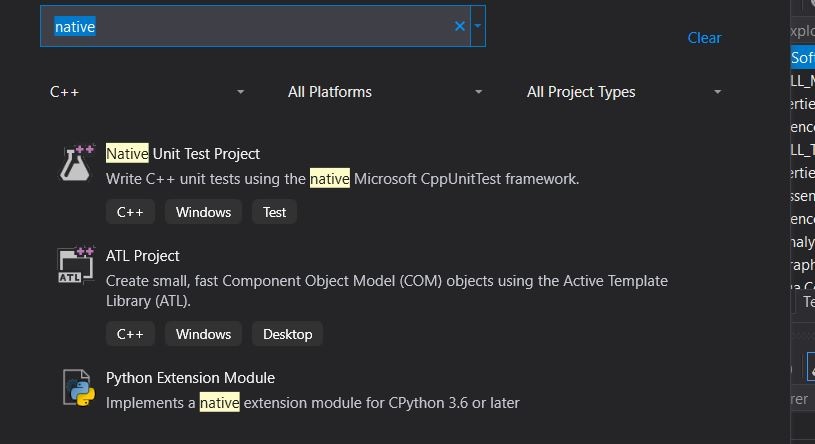
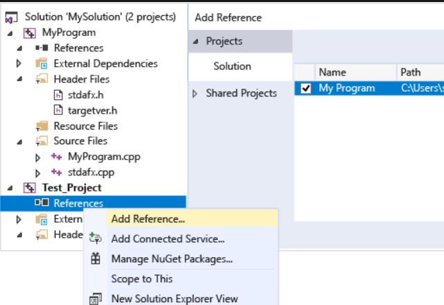
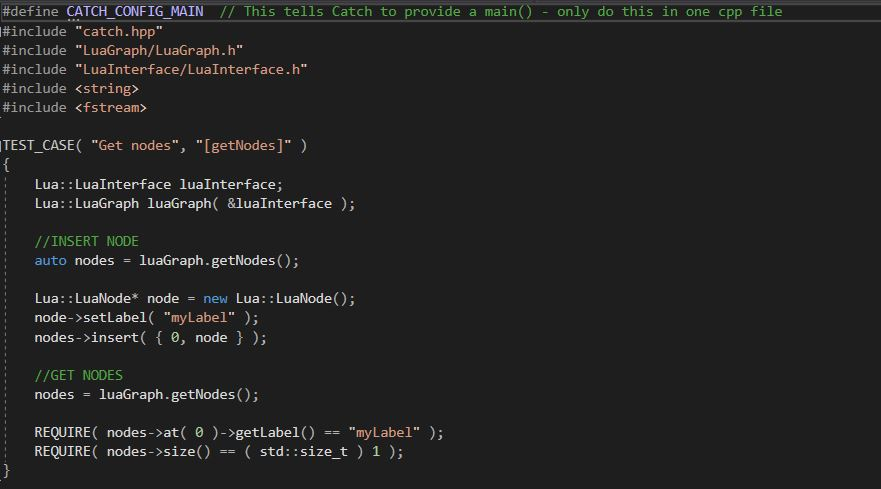

# C++ testy

Pre písanie nového testu je potrebné vytvoriť nový projekt v Solution. Ako nový projekt je potrebné Native Unit Test Project.

Pre povolenie prístupu testovacieho kódu vo funkciách v testovanom projekte je nutné pridať odkaz do projektu v testovacom projekte.

Je potrebné pridať `#include` pre všetky hlavičkové súbory, ktoré deklarujú typy a funkcie, ktoré chceme testovať.

## Spustenie testov
Testy sa nachádzajú v repozitároch [LuaInterface/tree/remake/tests](https://gitlab.com/FIIT/Common/Cpp/LuaInterface/tree/remake/tests)
a [LuaGraph/tree/remake/tests](https://gitlab.com/FIIT/Common/Cpp/LuaGraph/tree/remake/tests)
v branchi remake, ktoré sú najaktuálnejšie. Testy sa púšťajú pomocou CI v stage QA.
