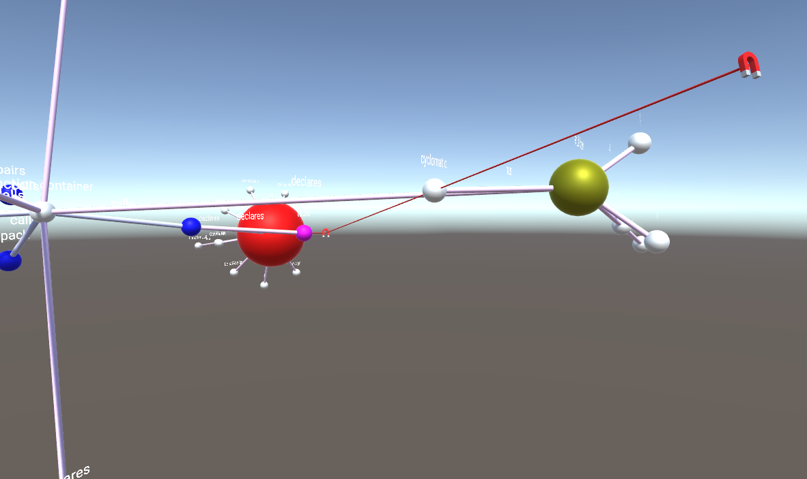
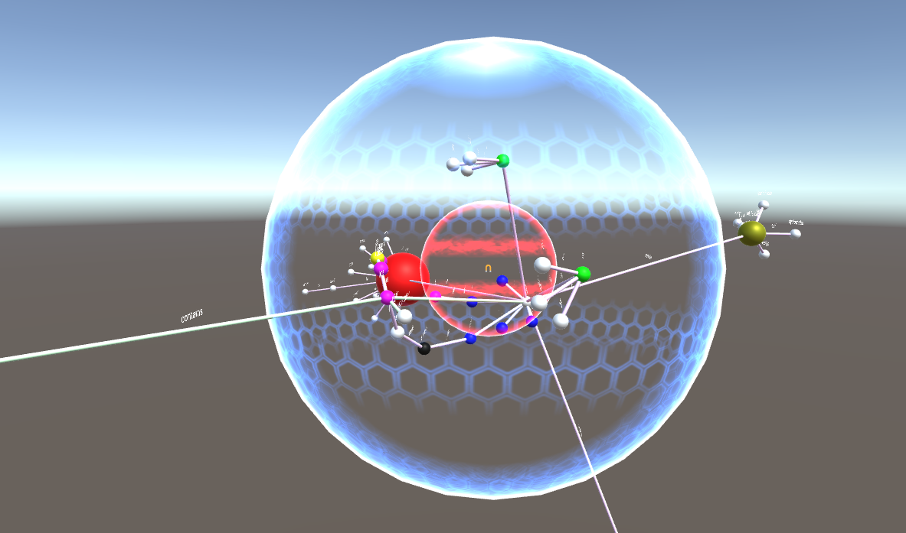

# 🧲 Magnety

Magnety slúžia na interakciu s grafom. Do scény je počas behu programu možné pridávať rôzne typy magnetov, ktoré k sebe priťahujú alebo odpudzujú uzly grafu, každý však iným spôsobom. V tejto príručke je opísané, ako pracovať s magnetmi celkovo a zároveň ako pracovať s jednotlivými druhmi magnetov samostatne.

## Ovládanie magnetov všeobecne

Do magnetového menu je možné dosať sa z hlavného menu pomocou stlačenia klávesy "M". To znamená, že keď počas behu programu stlačíme klávesu "M", dostaneme sa do hlavného menu. Ak následne opätovne stlačíme klávesu "M", dostaneme sa do magnetového menu. Tretie stlačenie klávesy spôsobí úplné zavretie všetkých menu a návrat do scény.

### Pridanie magnetu

Na pridanie magnetu do scény slúži v magnetovom menu horná rada tlačidiel, kde je možné zvoliť si príslušný typ magnetu. Po stlačení tlačidla s názvom príslušného magnetu, ktorý chceme pridať do scény sa magnet zobrazí v scéne v takzvanom "pridávacom móde". Magnet je vtedy priehľadný a vieme s ním hýbať (rovnako, ako sa pohybujeme v scéne - pomocou tlačidiel a myši). Keď magnet dostaneme do pozície, kde ho chceme umiestniť, pre potvrdenie pozície stlačíme Enter. V prípade, že pridávanie magnetu chceme ukončiť, je možné použiť buď tlačidlo Esc alebo tlačidlo "M".

### Zmena pozície magnetu

Magnet, ktorý je pridaný v scéne je nehybný. Zmenu jeho pozície však vieme vynútiť tlačidlom v menu "Change position". Po označení magnetu (klik myšou), ktorý chceme presunúť a stlačení tlačidla "Change position" (toto tlačidlo je možné stlačiť len v prípade, že je označený práve jeden magnet) sa dostane magnet do podobného módu ako v prípade pridávania magnetu. S magnetom je vtedy možné hýbať rovnako ako pri pridávaní a taktiež novú pozíciu magnetu potvrdíme klávesou Enter.

### Vymazanie magnetu

Magnet (alebo viaceré magnety) je možné vymazať tlačidlom "Delete magnet". Najprv treba označiť magnet/magnety, ktoré chceme vymazať a následne stlačiť tlačidlo "Delete magnet".

### Označenie magnetov

Označovanie magnetov funguje rovnako ako označovanie iných objektov v scéne. Po kliknutí na objekt (magnet) sa tento označí. V prípade, že ich chceme označiť viac, je možné ich označovať so stlačenou klávesou Ctrl.

V prípade, že máme v scéne vložených veľa magnetov a chceme nad všetkými naraz vykonať nejakú operáciu (napríklad ich všetky vymazať, alebo schovať), môžeme použiť tlačidlo "Select all magnets", ktorým označíme všetky magnety, ktoré sú aktuálne vložené v scéne.

### Skrytie a zobrazenie magnetov

Nie vždy chceme, aby sme mali magnety viditeľné v scéne. Niekedy potrebujeme, aby plnili svoju funkcionalitu, ale nechceme, aby boli viditeľné, aby sme mali graf prehľadnejší. Na ovládanie tejto funkcionality nám slúžia dve tlačidlá - "Hide selected magnets" a "Show hidden magnets". Tlačidlo "Hide selected magnets" funguje podobne ako pri vymazaní magnetov, najprv musia byť označené magnety, ktoré chceme skryť a po stlačení tlačidla sa funkcionalita schovania na tieto označené magnety aplikuje. Tlačidlo "Show hidden magnets" len zobrazí všetky skryté magnety (v prípade, že nejaké také sú). To znamená, že po stlačení tohto tlačidla sú všetky magnety, ktoré sú v scéne, viditeľné.

### Zmena typu magnetu

Ako bolo spomenuté, magnet môže byť rôzneho druhu. Existujú dokopy 3 druhy magnetov: také, ktoré interagujú s uzlami grafu na základe spojenia pomocou meta-hrany, také, ktoré interagujú s uzlami na základe definovanej vzdialenosti od magnetu a také, ktoré interagujú na základe nejakej definovanej funkcie (podmienky).

V magnetovom menu je predpripravený ovládací prvok na zmenu typu magnetu, avšak táto funkcionalita zatiaľ nie je implementovaná, takže s týmto ovládacím prvkom nie je možné interagovať.

## Magnet interagujúci na základe spojenia s uzlami

Tento typ magnetu priťahuje uzly, s ktorými je spojený meta-hranou. Na pridanie tohto magnetu do scény použijeme tlačidlo "Edge magnet". Samotné pridávanie je opísané vyššie vo všeobecnej časti "Pridanie magnetu".

### Spojenie magnetov s uzlami

Na to, aby tento typ magnetu priťahoval uzly, ho po pridaní do scény musíme spojiť s uzlami, ktoré chceme, aby priťahoval. Na to slúži tlačidlo "Connect magnet", ktoré môžme nájsť v magnetovom menu. Toto tlačidlo je možné použiť len vtedy, keď je označený práve jeden magnet a zároveň je to magnettypu "Edge magnet". Po stlačení tlačidla sa dostaneme do "spájacieho módu", kedy si pomocou myši môžme vybrať jeden alebo viacero uzlov grafu, s ktorými chceme magnet spojiť. Po označení uzlov tlačidlom Enter potvrdíme voľbu a magnet sa s uzlami spojí hranami. Zároveň magnet hneď začne uzly priťahovať. Spájací mód môžme kedykoľvek ukončiť pomocou klávesy Esc alebo "M". Magnet je možné spojiť s ľubovolným počtom uzlov. Takisto je možné k magnetu, ktorý už je spojený s nejakými uzlami kedykoľvek pridať nové spojenia.

### Zmazanie existujúcich spojení

Nepotrebné alebo nevyhovujúce spojenia je možné kedykoľvek odstrániť. Jednak sa všetky spojenia magnetu odstránia, pokiaľ odstránime samotný magnet. Taktiež je možné spojenia odstraňovať aj jednotlivo, bez toho, že by sme museli odstrániť celý magnet. Na toto nám slúži tlačidlo "Delete connection". Tlačidlo je možné použiť, keď je označená jedna alebo viac meta-hrán. Meta hrany označujeme rovnako ako ostatné objekty v scéne kliknutím myšou (prípadne klikaním myšou so stlačenou klávesou Ctrl, ak chceme označiť viacero hrán). Naraz môžme odstrániť meta-hrany patriace aj viacerým magnetom. Po označení všetkých meta-hrán, ktoré chceme vymazať stačí stlačiť tlačidlo "Delete connection" a týmto sa spojenia odstránia.

## Magnet interagujúci na základe vzdialenosti

Ďalším typom magnetu je magnet, ktorý priťahuje alebo odpudzuje uzly na základe vzdialenosti od magnetu. Na pridanie tohto typu magnetu do scény použijeme tlačidlo "Distance magnet". Samotné pridávanie je opísané vyššie vo všeobecnej časti "Pridanie magnetu".

### Nastavenie vzdialenosti

Na to, aby tento magnet fungoval mu musíme nastaviť vzdialenosť, v akej má okolité uzly priťahovať. Po pridaní tohto magnetu do scény môžme vidieť, že je okolo magnetu zobrazené modré (maximálna vzdialenosť) a červené (minimálna vzdialenosť) magnetické pole. Tieto vzdialenosti sú na začiatku nastavené na preddefinované malé hodnoty. Tieto hodnoty je možné zmeniť pomocou sliderov, ktoré nájdeme v ľavom hornom rohu obrazovky vedľa magnetového menu. Slidery je možné použiť po označení magnetu, ktorému chceme meniť vzdialenosti. Rovnako, ako pri vyššie spomínanom type magnetu, opäť musí byť označný práve jeden magnet, na to aby sme mu mohli meniť vzdialenosť a zároveň tento magnet musí byť typu "Distance magnet". Pomocou sliderov vieme magnetu nastaviť dve vzdialenosti: modré pole pôsobnosti (maximum radius) - to je také, v ktorom keď sa ocitnú uzly grafu, magnet ich začne k sebe priťahovať, a červené pole pôsobnosti (minimum radius) - to je také, za ktoré sa priťahované uzly grafu nikdy nedostanú, aby sa nepritiahli úplne k magnetu. V konečnom dôsledku to vyzerá tak, že priťahované uzly grafu sa zastavia na povrchu červeného pola pôsobnosti, na ktorom ostanú "nalepené". Z tohto vyplýva, že minimálna vzdialenosť a teda červené pole pôsobnosti nikdy nemôže byť väčšie, ako maximálna vzdialenosť a teda modré pole pôsobnosti. Sliderom "Maximum radius" sa nastavuje veľkosť polí celkovo, t.j. hýbu sa obe polia pôsobnosti, pričom je zachovaný pomer ich veľkostí, a sliderom "Minimum radius" sa nastavuje veľkosť menšieho poľa voči tomu väčšiemu. Po nastavení veľkostí nie je toto nastavenie nijako potrebné potvrdiť, nastavenie má účinnosť hneď ako je hýbané so slidermi.

## Magnet interagujúci na základe funkcie

Tento typ magnetu zatiaľ nie je implementovaný.