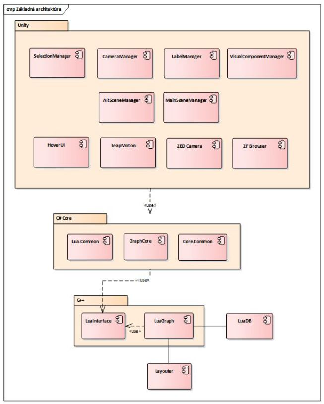

# Architektúra systému

## Celkový pohľad na systém

Kapitola obsahuje opis základnej architektúry projektu, jednotlivé vrstvy a ich moduly. Všetky moduly majú vybudovanú infraštruktúru, ktorá zahŕňa kompiláciu, testovanie, coverage, generovanie dokumentácie zo zdrojového kódu a jej export na vzdialený server.

### Základná architektúra

Architektúra projektu je zložená z 2 vrstiev - serverová Lua a klientská Unity. Na serverovej strane sa nachádzajú moduly jazyka Lua. Tieto moduly priamo narábajú s reprezentáciou grafových údajov a vykonávajú nad nimi operácie. Klientská strana je reprezentovaná Unity, ktoré poskytuje grafickú reprezentáciu údajov z Lua.  

Architektúru projektu je možné vidieť na obrázku nižšie.

### Lua
Na tejto vrstve sa nachádza reprezentácia grafových údajov. Jednotlivé operácie nad grafom sú teda vykonávané na tejto vrstve. Vo všeobecnosti dochádza k prepočítavaniu a zmenám súradníc uzlov, analýze zdrojového kódu a počítaniu metrík. Bližšie informácie o generovaní grafu je možné nájsť v [dokumentácii generovania grafu](../funkcionalita_systemu/generovanie_grafu/analyza_luaserver.md).  
S touto vrstvou úzko súvisí tiež jazyk Terra, v ktorom je implementovaný layoutovací algoritmus Fruchterman-Reingold. Na tejto vrstve je tiež možné analyzovať Moonscript projekty. Vrstva ďalej poskytuje funkcionalitu pre generovanie UML a sekvenčných diagramov. Vrstva je celkovo tvorená 5 modulmi.

#### Luadb
Logika modulu Luadb priamo súvisí s tvorbou grafu. Obsahuje reprezentáciu hrán, uzlov a metauzlov. V rámci modulu sú tiež implementované operácie, ktoré je možné nad grafom vykonávať. Bližší popis modulu a layoutovacieho algoritmu je možné nájsť v [dokumentácii Lua modulov](moduly_systemu/luaserver.md). Modul má vybudovanú [infraštruktúru](../infrastruktura/ci/lua/luadb.md).

#### Luametrics
Modul Luametrics vykonáva analýzu zdrojového kódu a produkuje AST, spolu s metrikami (LOC, blockdata, cyclomatic, functiontree, halstead, infoflow, statements). Modul má vybudovanú [infraštruktúru](../infrastruktura/ci/lua/luametrics.md).

#### Luameg
Úlohou modulu je vytváranie UML a sekvenčných diagramov zo zdrojových kódov. Modul podporuje jazyky Lua a Moonscript. Bližšie informácie k jednotlivým diagramom je možné nájsť v dokumentácii [UML diagramov](../funkcionalita_systemu/uml_diagramy.md). Modul má vybudovanú [infraštruktúru](../infrastruktura/ci/lua/luameg.md).

#### Luatree
Luatree je balík nástrojov na analýzu a inšpekciu AST, ktoré produkuje modul Luametrics, a grafov volaní funkcií vytváraných modulom Luadb. Modul má vybudovanú [infraštruktúru](../infrastruktura/ci/lua/luatree.md).

#### Luagit
Modul Luagit slúži na analýzu Git repozitárov, pričom k svojej činnosti využíva moduly Luametrics a Luadb. Modul má vybudovanú [infraštruktúru](../infrastruktura/ci/lua/luagit.md).

#### Luaserver
Modul Luaserver slúži ako server, ktorý k svojej činnosti využíva moduly ostatné moduly Lua. Jeho hlavnou funkcionalitou je komunikácia s Unity klientom, ale mimo toho sú v rámci tohto modulu implementované layoutovacie algoritmy ako Fruchterman-Reingold, City, CityFR alebo Street. Zároveň obsahuje operátory na zmenu atribútov pre uzly a hrany. Modul má vybudovanú [infraštruktúru](../infrastruktura/ci/lua/luaserver.md)

### Unity
Unity predstavuje klientskú časť, ktorá slúži na grafické zobrazenie grafových údajov. S Luaserverom komunikuje pomocou knižníc Message Pack a zeroMQ, pričom správy sú vo formáte JSON. Logika práce Unity s grafovými údajmi je popísaná v [dokumentácii generovania grafu](../funkcionalita_systemu/generovanie_grafu/analyza_unity.md). Vrstva zahŕňa viacero modulov. Bližší popis jednotlivých modulov je možné nájsť v [dokumentácii Unity modulov](moduly_systemu/archsys_modulysys_unity.md).