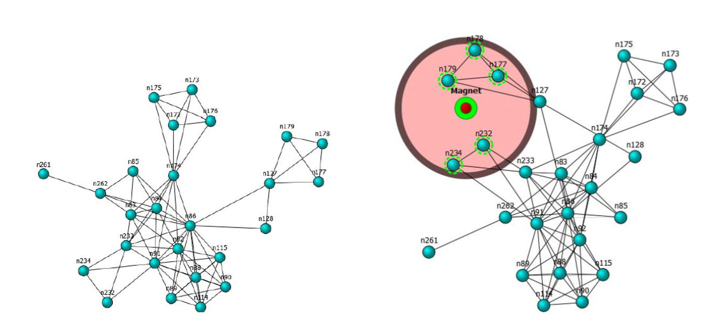

# 🧲 Magnety

Metauzly sú uzly, ktoré nie sú priamo súčasťou grafu, ale môžu ovplyvňovať výsledné rozloženie grafu. Tieto uzly majú fixné pozície a môžu byť pridané do scény napríklad používateľom. Môže byť viacero druhov metauzlov, z ktorých jedným druhom sú práve magnety.

Algoritmus použitý v tomto riešení podporuje tri typy metauzlov:

1. Priťahuje k sebe uzly, ktoré sú s ním spojené.
2. Priťahuje k sebe uzly, ktoré sa nachádzajú v určenom rozsahu vzdialenosti od metauzla.
3. To, či je uzol k metauzlu priťahovaný, je určené na základe funkcie,
   ktorej vstupom je konkrétny uzol. Takto môžeme zadefinovať aj komplikovanejšiu podmienku. (Zatiaľ neimplementované.)

Každý metauzol má určený aj násobič sily, ktorou má uzol priťahovať.

Ako je vyššie spomenuté, magnety k sebe priťahujú uzly v grafe, ktoré spĺňajú určité kritéria. Môže ísť napríklad o stupeň uzla, vzdialenosti od iného uzla alebo o nejakú vlastnosť, ktorú tento uzol v sebe nesie. Takéto kritérium však môže závisieť aj na iných magnetoch v scéne. Môžeme vytvoriť magnet, ktorý bude priťahovať všetky uzly, ktoré nie sú priťahované inými magnetmi. Magnety pôsobia príťažlivou silou na uzly, ktoré spĺňajú zadané kritérium a prípadne odpudivou silou na všetky zvyšné uzly v grafe.

Mnohokrát môže byť potrebné umiestniť uzly so spoločnými znakmi do určitého geometrického tvaru. V takomto prípade môžeme geometrický útvar umiestniť okolo magnetu. Magnet následne zaručí, že všetky uzly, ktoré spĺňajú kritérium, sú priťahované do určenej oblasti a zvyšné uzly sú od nej odpudzované.

Upravovanie rozloženia grafov silovo-riadených algoritmov pomocou magnetov bolo implementované vo vizualizačnom nástroji [MagnetViz](https://vimeo.com/2418990). Okrem vyššie popísaných použití magnetov, MagnetViz umožňuje používať aj hierarchie magnetov, kde dcérske magnety môžu priťahovať len určitú podmnožinu uzlov svojho rodiča. Na obrázku 1 vidíme graf rozložený nástrojom MagnetViz pred použitím magnetu a po použití magnetu spolu s geometrickým ohraničením.

Naľavo je graf bez použitia magnetu. Napravo vidíme ten istý graf spolu s magnetom a kruhom do ktorého magnet priťahuje uzly.

## Technická dokumentácia
Implementácia zahŕňa podporu v layoutovači (Terra časť) a obslužné Lua funkcie v layout manageri. Chýba podpora úprav metauzlov tretieho druhu, pre ktoré je potrebné navrhnúť spôsob definovania a priraďovania podmienkových funkcií. V súbore `luaserver\src\LuaScripts\Modules\layouter\algorithms\terra\fruchterman_reingold.t`, na riadkoch 273 až 305 je časť k magnetom. Táto časť slúži na vypočítanie príťažlivých a odpudivých síl medzi metauzlami a jednotlivými uzlami grafu a na preskupenie grafu. Na riadkoch 418 až 584 sa nachádzajú funkcie pre manažment metauzlov.

Layoutovač obsahuje pole `metaNodes` v ktorom sa ukladajú metauzly a premennú `metaNodeCount`. Pri pridávaní a odoberaní metauzlov sa pole realokuje na menšie alebo väčšie a príslušne sa zmení aj hodnota premennej. Metauzly sa kedysi nachádzali priamo v grafe, teraz sú už oddelené v tomto poli.

Implementácia je robená podľa vzoru [obmedzovačov](obmedzovace.md). Implementáciu pridávania obmedzovačov môžeme vidieť v súbore `luaserver\src\LuaScripts\Modules\layouter\layout_manager.lua`. Z tohto súboru sa následne volá funkcia s implementovaným algoritmom na layoutovanie - v našom prípade už spomínaný `fruchterman_reingold.t`, keďže v tomto je spravená predpríprava na magnety. V súbore `layout_manager.lua` sa zavolá funkcia `runLayouting()`, ktorá na viacero krokov nakoniec v súbore `fruchterman_reingold.t` spustí funkciu `calculateLayout()`, ktorá už zabezpečuje samotné layoutovanie. Funkcie na pridávanie a upravovanie obmedzovačov sú volané zo súboru `3dsoftvis_remake\Projects\3DSoftviz\UnityProject\Assets\_Refactoring\Scripts\Layouting\LayoutManager.cs`
od riadku 139 a pre magnety od riadku 322.

### Zhrnutie

1. Čo bolo doposiaľ implementované

    * layoutovanie metauzlov (magnetov) - Terra
    * pridávanie a upravovanie magnetov - Lua
    * pridávanie a upravovanie magnetov - C#

2. Čo bude treba implementovať v budúcnosti

    * metauzly tretieho druhu
        * pridávanie a upravovanie magnetov - Terra, Lua, C#
    * interakcia s používateľom - Unity
    * testy

## Testy

Testy pre túto funkcionalitu zatiaľ neexistujú, preto sa zatiaľ snažíme spraviť aspoň high-level návrh testov.

### High-level návrh testov

1. __Test na počet metauzlov__ - či sedí premenná `metaNodesCount`
   s reálnym počtom metauzlov v poli
2. __Test na fixnosť metauzlov__ - keďže metauzly majú mať fixné pozície,    pridáme do scény zopár magnetov, prejdeme zopár iteráciami layoutovania a skontrolujeme, či je každý z magnetov naozaj na tej pozícii, kam sme ho umiestnili
3. __Test na vzdialenosť od prvého druhu magnetu__ - vytvoríme magnet, ktorý bude spojený s jedným uzlom grafu, vypočítame ich vzdialenosť vzdušnou čiarou, takisto si náhodne vyberieme zopár ďalších uzlov v grafe a vypočítame ich vzdialenosť - po prelayoutovaní by sa mala vzdialenosť uzla spojeného s magnetom od magnetu zmenšiť a vzdialenosť ostatných náhodne vybraných uzlov od magnetu by sa nemala zmenšiť (to znamená, že ostane rovnaká, alebo sa zväčší)
4. __Test na vzdialenosť od druhého druhu magnetu__ - analogicky k testu na prvý druh magnetu spravíme test aj na tento druh magnetu
5. __Test na vzdialenosť od tretieho druhu magnetu__ - analogicky k testu na prvý druh magnetu spravíme test aj na tento druh magnetu