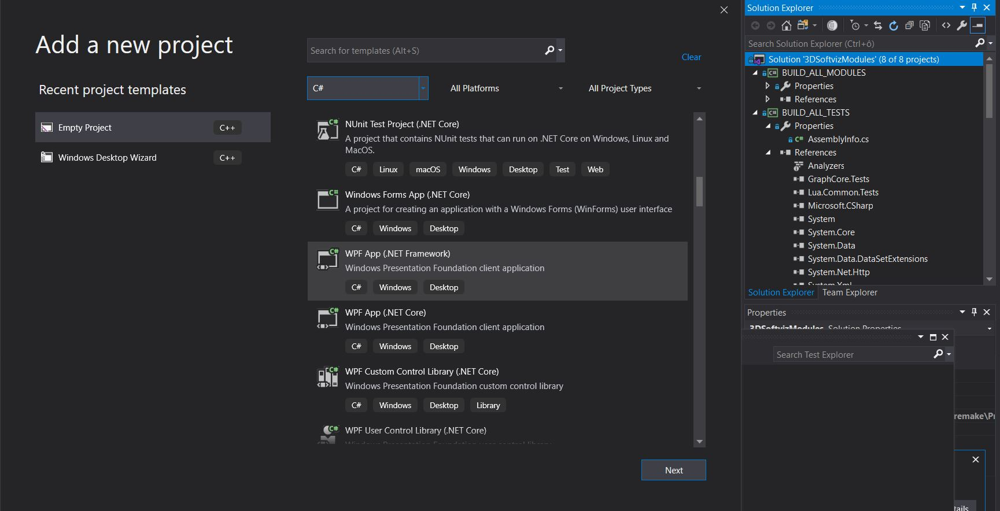
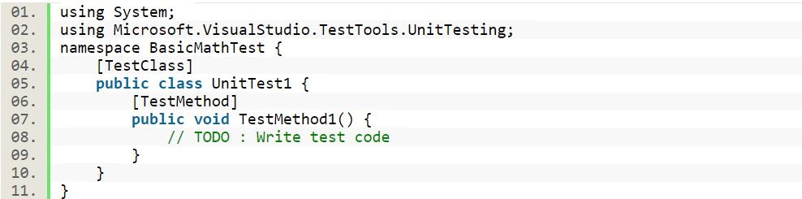
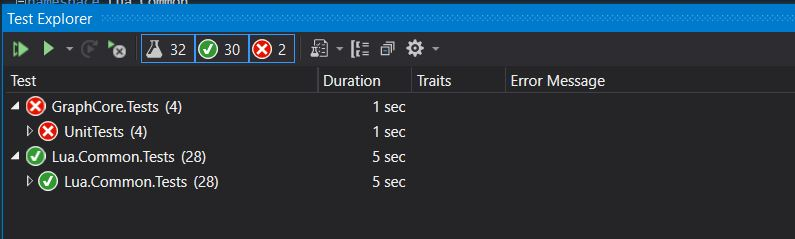

# C# testy

Pre písanie nového testu, je potrebné vytvoriť nový projekt v Solution. Ako nový projekt je potrebné NUnit Test Project (.NET Framework)



Následne je potrebné pridať potrebné namespaces.

Príklad:
``` C#
using Lua.Common.Graph;
using NUnit.Framework;
using System;
using System.Collections.Generic;
using System.Linq;
using System.Text;
using System.Threading.Tasks;
```

Pre testovanie triedy je potrebné používať atribút `[TestClass]` a pre testovanie metódy triedy je potrebné používať `[TestMethod]`.



Metóda `Assert.AreEqual(x,y)` porovnáva či tieto dva vstupy sú rovnaké. Napríklad `x` je hodnota metódy triedy, ktorú testujeme a `y` správna hodnota, ktorú očakávame.



## Spustenie testov
Pre spustenie testov je potrebné nainštalovať do Visual Studia komponent NUnit 3 Test Adapter. Následne je potrebné do priečinkov (`CSProjects\Lua.Common.Tests\bin\Debug`, `CSProjects\GraphCore.Tests\bin\Debug`) prekopírovať knižnice `lua51.dll`, `luagraph.dll`, `luainterface.dll`.

`AllNodesHasPosition` a `Graph_LoadGraph` aktuálne nezbehnú, ale vo výsledkoch
predchádzajúcich testov, ktoré vykonávali predchadzajúce tímy zbehli úspešne.
