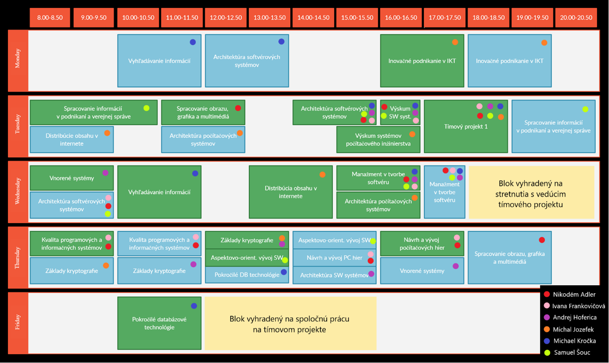

# 🔢 Príloha B - Rozvrh tímu
Na Obrázku 1 je znázornený rozvrh cvičení a prednášok v zimnom semestri všetkých členov 
tímu. Podľa farebných guličiek a legendy v spodnej časti obrázka je možné rozoznať 
povinnosti jednotlivých členov tímu.

Na tímový projekt sme si vyhradili v rozvrhu dva bloky. Jeden trojhodinový v stredu od
18:00 do 21:00 na stretnutie s vedúcim projektu a jeden štvorhodinový v piatok od 12:00
do 16:00 na spoločnú prácu na projekte.

